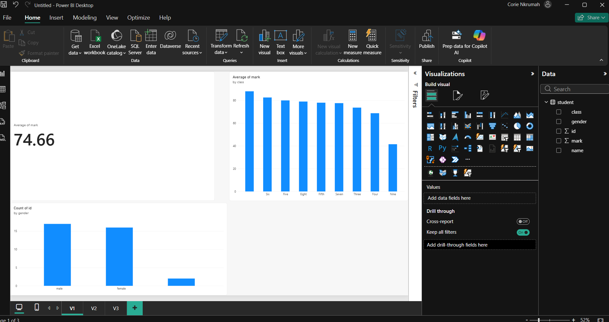

# Student Performance Dashboard

## Aim
The aim of this project is to analyse student performance and present the findings using Power BI.

## Dataset
The project uses student performance data including class, gender, student ID, mark and student name.

The dataset can be found in the `Dataset` folder.

## Analysis
The Power BI dashboard looks at:
- Average student mark
- Average mark by class
- Number of students by gender

## Dashboard Preview

## Tools Used
- Power BI
